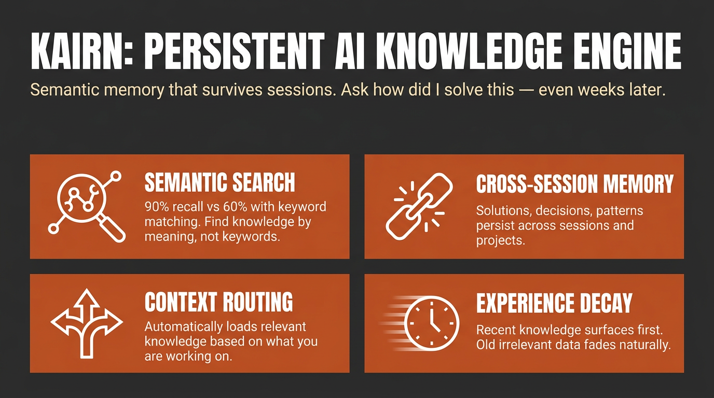

# Kairn




> Context-aware knowledge engine for AI assistants.

**Status: Alpha (v0.2.0).** The API and CLI are functional and tested (see
[Development](#development)), but interfaces may still change between
releases. Feedback and issues welcome.

Other tools give your AI a memory. **Kairn** gives it a knowledge graph with intelligent context routing. It knows what to load, when to load it, and how much - so your AI stays focused, not overwhelmed.

```bash
pip install kairn-ai
kairn init ~/brain
kairn serve ~/brain
```

Add it to Claude Code in one line:

```bash
claude mcp add kairn -- kairn serve ~/brain
```

For other clients, see [Quick Start](#quick-start) below. New to Kairn? Jump to [First 5 Minutes](#first-5-minutes).

## Why Kairn?

Every AI conversation starts from scratch. Previous insights, decisions, and patterns - gone. Existing memory tools store flat key-value pairs that can't represent relationships or surface the *right* context at the *right* time.

Kairn is different:

- **Context Router + Progressive Disclosure** - Automatically loads relevant subgraphs based on keywords, starting with summaries and drilling into details only when needed. No other tool does this.
- **Knowledge Graph with FTS5** - Not flat storage. Typed relationships (`depends-on`, `resolves`, `causes`) between nodes with provenance tracking and full-text search across everything.
- **Experience Decay + Auto-Promotion** - Experiences lose relevance over time (biological decay model). Frequently-accessed experiences auto-promote to permanent knowledge. Your AI naturally forgets what doesn't matter.
- **22 MCP Tools** - Works with Claude Desktop, Cursor, VS Code, Windsurf, and any MCP client. Includes `kn_judge` for 5-verb relationship judgments and `kn_doctor` for read-only health diagnostics.
- **Per-Workspace Isolation** - Each workspace is its own isolated SQLite store. JWT auth and role-based access control (owner / maintainer / contributor / reader) ship for team deployments.

## Quick Start

### Claude Desktop

Add to `~/Library/Application Support/Claude/claude_desktop_config.json`:

```json
{
  "mcpServers": {
    "kairn": {
      "command": "kairn",
      "args": ["serve", "~/brain"]
    }
  }
}
```

### Cursor

Add to `.cursor/mcp.json`:

```json
{
  "mcpServers": {
    "kairn": {
      "command": "kairn",
      "args": ["serve", "~/brain"],
      "env": {
        "KAIRN_LOG_LEVEL": "WARNING"
      }
    }
  }
}
```

### VS Code

Add to `.vscode/mcp.json`:

```json
{
  "servers": {
    "kairn": {
      "type": "stdio",
      "command": "kairn",
      "args": ["serve", "~/brain"]
    }
  }
}
```

### Windsurf

Add to `~/.codeium/windsurf/mcp_config.json`:

```json
{
  "mcpServers": {
    "kairn": {
      "command": "kairn",
      "args": ["serve", "~/brain"]
    }
  }
}
```

Restart your editor. Kairn's 22 tools appear in the MCP section.

## First 5 Minutes

A guided first run, end to end:

```bash
pip install kairn-ai
kairn init ~/brain              # creates the workspace + database
```

Add the one-liner from above (or your client's Quick Start snippet), then restart the client. Once connected, ask your assistant to remember something:

> "Remember that we chose Postgres over SQLite for the analytics service because we needed concurrent writers."

That calls `kn_learn` under the hood and returns a JSON envelope like this (captured from a real run, via `kairn learn`, the CLI mirror of the tool):

```json
{"_v": "1.0", "stored_as": "node", "node_id": "002d9c22", "experience_id": "d0710c2f", "type": "decision", "confidence": "high", "namespace": "knowledge", "candidates": []}
```

Start a **new** session and ask it to recall the same thing - that calls `kn_recall` and surfaces what you just stored, no re-explaining required:

```json
{"_v": "1.0", "count": 2, "results": [
  {"source": "node", "id": "002d9c22", "name": "Decision: we chose Postgres over SQLite for the analytics service beca", "type": "learned_decision", "description": "we chose Postgres over SQLite for the analytics service because we needed concurrent writers", "relevance": 1.0},
  {"source": "experience", "id": "d0710c2f", "type": "decision", "content": "we chose Postgres over SQLite for the analytics service because we needed concurrent writers", "confidence": "high", "relevance": 1.0}
]}
```

`kn_learn` stored both a permanent graph node and a decaying experience (high confidence does both, see [Confidence routing](#decay-model)); `kn_recall` found both from a three-word topic.

Run `kairn status ~/brain` any time as a smoke test - if it prints a JSON stats block (nodes/edges/experiences counts), the workspace is healthy. Want a scripted tour of every core feature instead of doing it by hand? Run `kairn demo ~/brain` - it walks through node creation, querying, experience saving, learning, recall, and context in about 30 seconds.

### Which tool when

22 tools is a lot to hold in your head on day one. Most sessions only need these:

| You want to... | Use | Why |
|---|---|---|
| Remember something new (a decision, gotcha, pattern, solution) | `kn_learn` | Default entry point - auto-routes to a permanent node (high confidence) or a decaying experience (medium/low), no need to decide yourself |
| Capture a stated user preference the moment it is expressed | `kn_preference` | Dedicated preference write path - you (the calling model) state the preference as one explicit sentence; stored with the longest half-life of any type |
| Add a permanent named concept you already know is durable | `kn_add` | Skips decay entirely - for structural knowledge, not day-to-day experience |
| Log a one-off experience with explicit confidence/decay control | `kn_save` | Lower-level primitive `kn_learn` wraps - reach for it when you want to set confidence/decay yourself |
| Search the permanent knowledge graph by text, type, tags, or namespace | `kn_query` | You're looking for nodes, not decaying experiences |
| Search saved experiences, ranked by relevance and decay | `kn_memories` | You're looking for experience content (solutions, gotchas, workarounds), not graph nodes |
| Surface everything relevant to a topic in one call | `kn_recall` (flat list) or `kn_context` (subgraph, progressive disclosure: summary first, full detail on demand) | You don't know yet whether the answer is a node or an experience - let Kairn search both |

Everything else (`kn_crossref`, `kn_related`, `kn_connect`, `kn_judge`, `kn_project`/`kn_projects`/`kn_log`, `kn_idea`/`kn_ideas`, `kn_promote_pending`, `kn_prune`, `kn_remove`, `kn_status`, `kn_doctor`) is advanced usage - see the full [22 Tools](#22-tools-kn_-prefix) reference below once you're past the basics.

## 22 Tools (kn_ prefix)

All tools follow MCP protocol with JSON responses.

### Graph (6)

| Tool | Description |
|------|-------------|
| `kn_add` | Add node to knowledge graph |
| `kn_connect` | Create typed edge between nodes (lax-mode vocabulary) |
| `kn_judge` | Record 5-verb judgment edge (strict mode: `conflicts_with` / `supersedes` / `compatible` / `scoped` / `related`) |
| `kn_query` | Search by text, type, tags, namespace |
| `kn_remove` | Soft-delete node or edge (undo-safe) |
| `kn_status` | Graph stats, health, system overview |

### Project Memory (3)

| Tool | Description |
|------|-------------|
| `kn_project` | Create or update project |
| `kn_projects` | List projects, switch active |
| `kn_log` | Log progress or failure entry |

### Experience Memory (5)

| Tool | Description |
|------|-------------|
| `kn_save` | Save experience with decay |
| `kn_preference` | Capture a stated user preference at utterance time (longest half-life) |
| `kn_memories` | Decay-aware experience search |
| `kn_prune` | Remove expired experiences |
| `kn_promote_pending` | Promote high-access experiences to permanent nodes |

### Ideas (2)

| Tool | Description |
|------|-------------|
| `kn_idea` | Create or update idea |
| `kn_ideas` | List/filter ideas by status, category |

### Intelligence (5)

| Tool | Description |
|------|-------------|
| `kn_learn` | Store knowledge with confidence routing |
| `kn_recall` | Surface relevant past knowledge |
| `kn_crossref` | Find similar past solutions in the current workspace |
| `kn_context` | Keywords → relevant subgraph with progressive disclosure |
| `kn_related` | Graph traversal (BFS) to find connected nodes |

### Diagnostic (1)

| Tool | Description |
|------|-------------|
| `kn_doctor` | Read-only health checks (lock mode, FTS5 parity, promotion backlog, namespace sprawl, orphan edges) - returns structured envelope with per-check verdicts and roll-up summary |

## Resources & Prompts

**Resources** (read-only context for MCP clients):
- `kn://status` - Graph overview, active project
- `kn://projects` - All projects with recent progress
- `kn://memories` - Recent high-relevance experiences

**Prompts** (session management):
- `kn_bootup` - Load active project, recent progress, and top memories (session start)
- `kn_review` - Summarize session and suggest next steps (session end)

## How It Works

### Architecture

```
Any MCP Client (Claude, Cursor, VS Code)
        │
        ▼ MCP Protocol (stdio)
FastMCP Server (22 tools)
        │
   ┌────┼────┐
   ▼    ▼    ▼
Graph  Memory  Intelligence
Engine Engine  Layer
   │    │      │
   └────┼──────┘
        ▼
   SQLite + FTS5
   (per-workspace)
```

### Decay Model

Experiences decrease in relevance exponentially:

```
relevance(t) = initial_score × e^(-decay_rate × days)
```

| Type | Half-life | Notes |
|------|-----------|-------|
| solution | 120 days | Stable, durable |
| pattern | 90 days | Architectural knowledge |
| decision | 100 days | Context-dependent |
| workaround | 40 days | Temporary fixes fade fast |
| gotcha | 70 days | Tricky pitfalls stay relevant |
| preference | 180 days | Durable user preferences - initial estimate, not yet tail-calibrated |

Half-lives are calibrated against the real access tail of a production experience store, not guessed (one exception: `preference` is a new type with no access history yet, so its value is a documented initial estimate until real data accumulates).

**Confidence routing** via `kn_learn`:
- `high` → Permanent node + experience (no decay)
- `medium` → Experience with 2× decay
- `low` → Experience with 4× decay
- Auto-promotion: 5+ accesses → permanent node
- Node access tracking: `kn_recall`, `kn_context`, and `kn_crossref` log which nodes were accessed, feeding the decay and promotion pipeline

## Benchmarks

Kairn scores **56.2% overall on LongMemEval-S** (500/500 questions scored,
GPT-4o reader + judge, single run, 0 errors). These are the real per-category
numbers, including the bad ones - each red cell links to its diagnosis:

| Category | n | Accuracy | Diagnosis |
|----------|----|----------|-----------|
| single-session-user | 70 | 91.4% | - |
| single-session-assistant | 56 | 83.9% | - |
| knowledge-update | 78 | 70.5% | - |
| temporal-reasoning | 133 | 42.9% | [why](BENCHMARKS.md#temporal-reasoning-429) |
| multi-session | 133 | 41.4% | [why](BENCHMARKS.md#multi-session-414) |
| single-session-preference | 30 | 10.0% | [why](BENCHMARKS.md#single-session-preference-100) |

The 500 questions include 30 abstention variants (the right answer is to
decline); they are counted inside their categories above and scored
separately: Kairn declines correctly on **96.7%** of them.

Recall latency is ~1.4 ms per query (FTS5, in-process, no network). Protocol,
honesty notes, and reproduction steps: [BENCHMARKS.md](BENCHMARKS.md).

This scorecard stays current: every release that touches recall re-publishes
these numbers, and a weak cell stays on the board until the number actually
moves. No cherry-picked runs, no hidden categories.

## CLI

```bash
kairn init <path>              # Initialize workspace
kairn serve <path>             # Start MCP server (stdio)
kairn status <path>            # Graph stats
kairn demo <path>              # Interactive tutorial
kairn benchmark <path>         # Local performance benchmarks (latency, not LongMemEval)
kairn token-audit <path>       # Audit tool token usage
```

## Configuration

```bash
KAIRN_LOG_LEVEL=INFO|DEBUG|WARNING    # Default: WARNING
KAIRN_DB_PATH=~/brain/.kairn         # Default: {workspace}/.kairn
KAIRN_CACHE_SIZE=100                  # LRU cache entries
KAIRN_JWT_SECRET=<your-secret>        # Required for team features
```

## Development

```bash
git clone https://github.com/primeline-ai/kairn
cd kairn
pip install -e ".[dev,team]"
pytest tests/ -v --cov
ruff check src/ && ruff format src/
```

### Project Structure

```
src/kairn/
├── server.py              # FastMCP server + 22 tools
├── cli.py                 # CLI commands
├── config.py              # Configuration
├── core/
│   ├── graph.py           # GraphEngine (6 tools)
│   ├── memory.py          # ProjectMemory (3 tools)
│   ├── experience.py      # ExperienceEngine (4 tools)
│   ├── ideas.py           # IdeaEngine (2 tools)
│   ├── intelligence.py    # IntelligenceLayer (5 tools)
│   └── router.py          # ContextRouter
├── storage/
│   ├── base.py            # Storage interface
│   └── sqlite_store.py    # SQLite + FTS5 implementation
├── models/                # Data models
├── events/                # Event bus
└── auth/                  # JWT + RBAC (team feature)
```

## Performance

Typical operation times on modern hardware:

| Operation | Time |
|-----------|------|
| `kn_add` | 2-5ms |
| `kn_query` (100 nodes) | 5-15ms |
| `kn_connect` | 1-3ms |
| `kn_recall` (graph traversal) | 10-50ms |
| `kn_crossref` (similarity search) | 20-100ms |

## Used By

| Project | What It Uses Kairn For |
|---------|----------------------|
| [Quantum Lens](https://github.com/primeline-ai/quantum-lens) | Persistent insight storage, cross-analysis pattern tracking, lens effectiveness metrics |
| [Claude Code Starter System](https://github.com/primeline-ai/claude-code-starter-system) | Session memory, project state, learning persistence |

## License

MIT

---

## Part of the PrimeLine Ecosystem

| Tool | What It Does | Deep Dive |
|------|-------------|-----------|
| [**Evolving Lite**](https://github.com/primeline-ai/evolving-lite) | Self-improving Claude Code plugin - memory, delegation, self-correction | [Blog](https://primeline.cc/blog/knowledge-architecture) |
| [**Kairn**](https://github.com/primeline-ai/kairn) | Persistent knowledge graph with context routing for AI | [Blog](https://primeline.cc/blog/knowledge-architecture) |
| [**tmux Orchestration**](https://github.com/primeline-ai/claude-tmux-orchestration) | Parallel Claude Code sessions with heartbeat monitoring | [Blog](https://primeline.cc/blog/tmux-orchestration) |
| [**UPF**](https://github.com/primeline-ai/universal-planning-framework) | 3-stage planning with adversarial hardening | [Blog](https://primeline.cc/blog/planning-framework-dsv-reasoning) |
| [**Quantum Lens**](https://github.com/primeline-ai/quantum-lens) | 7 cognitive lenses for multi-perspective analysis | [Blog](https://primeline.cc/blog/quantum-lens-multi-agent-analysis) |
| [**PrimeLine Skills**](https://github.com/primeline-ai/primeline-skills) | 5 production-grade workflow skills for Claude Code | [Blog](https://primeline.cc/blog/score-based-auto-delegation) |
| [**Starter System**](https://github.com/primeline-ai/claude-code-starter-system) | Lightweight session memory and handoffs | [Blog](https://primeline.cc/blog/session-management) |

**[@PrimeLineAI](https://x.com/PrimeLineAI)** · [primeline.cc](https://primeline.cc) · [Free Guide](https://primeline.cc/guide)
